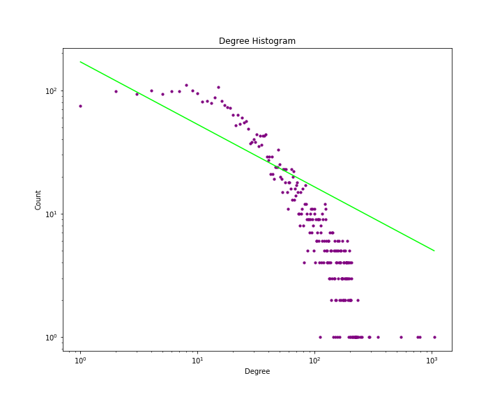

 <h1> Network Analysis: Assignment 1 </h1> 

 
<h5 style="text-align: right">Simone Campisi s4341240 </h5>
<h5 style="text-align: right">Jacopo Dapueto s4345255 </h5>

## 1. Information about the dataset
This dataset consists of 'circles' (or 'friends lists') from Facebook collected from survey participants. The dataset includes node features (profiles), circles, and ego networks.
It's been downloaded from [Stanford Network Analysis Project](https://snap.stanford.edu/data/ego-Facebook.html).
The linked page provides two different dataset:

  - The first contains 10 ego networks, each one has the edge list, a list of clicles (each one constisting of list of nodes), and other features of the network. An <i> Ego-centric network</i> (or <i>"ego" networks</i>), is particular type of network in which specifically maps the connections of and from the perspective of a single person (an ego). In fact this networks represent circles of friends of a certains person (ego).
  - The second is the one used in the assignment and it is obtained combining all the ego-networks, including the ego nodes themselves, along with an edge to each of their friends.

To visualize the network we used <b>Gephi</b> which provides functionalities to process networks, especially for very large networks. 

One of them identifies the <i>communities</i> through the <i>modularity</i> measure and to each community is assigned a different color. In the image below the community are  densely connected components, and sparsely connected with the rest of the network. So this is a good way to represent the ego netework, because is possible to see better the circles of friends.

 
## 2. Analysis

The following table shows the global statistics we used to analyze the network in the following chapters.

| Dataset statistics | Values |
|--------------------|------- |
| Nodes | 4039                |
| Edges | 88234               |
| Average Degree | 43.691     |
| Average clustering | 0.605  |
| Global clustering |    0.51 |
| Nodes giant component| 4039 |
| Diameter |               8  |
| Average shortest path | 3.69|
| Density |         0.01      |
| Assortativity |     0.06    |

   

### 2.1. Does the graph have the same characteristics of a random or a power-law network?

To answer to the question we first visualize the degree distribution together with the fitted curve. Each dot represent a degree and the frequency it appears in the dataset.
   

  |  |
  |:--: |
  | *Figure 1 - Degree Distribution and fitting of the curve* |
  
  
  Observing the chart of the degree distribution ( <i> figure 1 </i>) is it possible to notice that the degree distribution follows the trend of a <i>power law</i> and the fittd curve is described by the equation .
 
   

  
  
  |  |
  |:--: |
  | *Figure 2 - Curve fitted plotted in logarithmic scale* |
  
  
 Hence in the <i> figure 1 </i> is represented the degree distribution in a scatterplot with the curve that represents the trend of the distribution. The curve has been calculated making the fit of the curve, estimating the parameter <i> C </i> and   of the power law equation. This latest curve allows to prove that the degree destribution is effectively power law, in fact, plotting the curve in logarithmic scale, is possible to notice that the graphic follows a straight line, and this a characteristic of a degree distribution that follows a power law <i> ( figure 2 ) </i>.
 
 
 What can be further observed in the figure 2, is that our network doesn't have a degree distribution that follows a pure power law. In fact real networks rarely observe a degree distribution following a pure power law, instead real systems display a shape similar to what is show in the figure 2 that share some features:
 - **Low-degree saturation** that is shown in the initial flatten  region. This happen when the network have  fewer small degree nodes than expected for a pure power law.
 - **High-degree cutoff** appears as a rapid drop in  : which means that the network has fewer high-degree nodes than expected in a pure power law, and also limiting the size of the hubs. This happens when there is a limitation in the number of links a node can have. Since our system is taken from a social network, is cutoff may be a due to the fact that one person can hardly mantain a deep and meaningful relation with a lot of people.

 The degree distribution follows a power law distribution but it's not a <i>scale free</i> network, as can be observed in the distribution above there are a few hubs (already descibed as **High-degree cutoff**) and this suggests that the second moment of the degree distribution doesn't diverge. 
 We tried to simulate the average path length as the network grows: starting from a random set of nodes and step by step add nodes and edges so that the network remains connected.
 The follwing image shows the tendecy of the distance, since the first nodes are randomly selected the distance doesn't follow one of the highlighted curves but then it converges to the  one. 
 
 |  |
  |:--: |
  | *Figure 3 - average shortest path as the number of nodes increases* |
  
 
This result suggests that the  might be equal to 3, which is the critical point between the *Ultra-small world* and the *Small world* regimes where the hubs are still enough to shrinks the distances compared to a random network of similar size.
However we cannot be sure about that because of the limited dimension of the dataset.
    

### 2.2. Which are the most important nodes, with respect to a given centrality measure?

We decide to measure the "importance" of the nodes considering the betweenness, the closeness centrality and the degree.
|Betweenness|Closeness|Degree|
|--|--|--|
|<table> <tr><th>Node</th><th>Value</th></tr><tr><td>**107**</td><td>0.480</td></tr> <tr><td>**1684**</td><td>0.337</td></tr> <tr><td>3437</td><td>0.236</td></tr> <tr><td>1912</td><td>0.229</td></tr> <tr><td>1085</td><td>0.149</td></tr> <tr><td>0</td><td>0.146</td></tr> <tr><td>698</td><td>0.115</td></tr><tr><td>567</td><td>0.096</td></tr> <tr><td>58</td><td>0.084</td></tr> <tr><td>428</td><td>0.064</td></tr> </table>| <table> <tr><th>Node</th><th>Value</th></tr><tr><td>**107**</td><td>0.459</td></tr>  <tr><td>58</td><td>0.397</td></tr> <tr><td>428</td><td>0.394</td></tr> <tr><td>563</td><td>0.393</td></tr> <tr><td>**1684**</td><td>0.393</td></tr> <tr><td>171</td><td>0.370</td></tr> <tr><td>348</td><td>0.369</td></tr><tr><td>483</td><td>0.369</td></tr> <tr><td>414</td><td>0.369</td></tr> <tr><td>376</td><td>0.366</td></tr></table>| <table> <tr><th>Node</th><th>Value</th></tr><tr><td>**107**</td><td>1045</td></tr>  <tr><td>**1684**</td><td>782</td></tr> <tr><td>1912</td><td>792</td></tr> <tr><td>3437</td><td>547</td></tr> <tr><td>0</td><td>347</td></tr> <tr><td>2543</td><td>294</td></tr> <tr><td>2347</td><td>291</td></tr><tr><td>1888</td><td>254</td></tr> <tr><td>1800</td><td>245</td></tr> <tr><td>1663</td><td>235</td></tr></table>

The table above shows the top 10 nodes with maximum betweeness and the top 10 nodes with maximum closeness and the nodes present in all the ranking are highlighted.

The betweeness measures how many short paths pass to, instead the closeness measures the mean distance from a vertex to the other vertices and therefore the nodes with high closeness can have an easy access to information of influence on other nodes.

As can be seen from the table the node *107* it has the highest betweeness and the higher closeness, so we can say that such node is very important in the network and in the main cluster that is in the center of it.

The closeness measures don't vary too much from one node to the other, and this can be due to the logarithmic growth of shortest paths.
By constrast the betweeness measures in the ranking dedreases very fast, so there are few nodes which lead the communication between the clusters of the network. In fact it can be seen from the graph above that few nodes connect the cluster to the "center" of the network.
 
### 2.3. Are the paths short with respect to the size of the network?
   
  The <i>shortest path (or geodesic path)</i>  between two nodes in a network the number of links. The length of a shortest path is called <i> shortest distance </i>.
  The <i> average shortest path </i>, instead, is the average of the shortest paths between all the pairs nodes, and in the network we are considering is about 3.69. So, is possible to say that in this network there is a <b> small-world effect </b> because the average shortest path is surprisingly short when compared with the numkber of nodes of the network, that are 4039.

### 2.4. Is the network dense?
   
  The <b> density </b> of a network is the defined by the following formula:
    
  
  
 
  
   ,in which L is the total number of links and N is the total number of nodes, it is the number of edges in the network over maximun number of possible edges in the network. On our network the value is 0.01, this means that the network is <b> sparse</b>.  
### 2.5. Is the network assortative?

  In a network can be measured the assortative mixing according to the degree distribution and:
  - In an **assortative network** high-degree nodes tend to stick together and the structure of the network is characterized by a *core* of high-degree nodes. Hence hubs tend to link to each other and avoid linking to small-degree nodes meanwhile small-degree nodes tend to connect to other small-degree nodes avoiding hubs.
  - In a **disassortative network** hubs avoid linking each other, and tends to link to small-degree nodes. The network result in a hub-and-spoke topology.
 
 The pearson correlation coefficient of our network is 0.06, which means that the network is non-assortative and there is no a particular correlation between the degrees.
 It can be undestood looking at the image of the network: the network is made up of clusters where some of them seems to be a hub-and-spoke topology and the others seems to have a *core* of high-degree nodes surrounded by a sparser periphery. So there isn't a dominant mixing.
    
### 2.6. Average clustering

The <i> average clustering </i> is the average of all the <i> local clustering coefficients</i>, defined as
 
 
  

 
 , in which  is the number of links between the  neighbors. It captures the density of links in i’s immediate neighborhood, and it is in the range [0,1]. In this case, the mean value of the network is 0.605 and this means that there is in average a 60.5% of probability that a node randomly selected has two neighbors linked.
